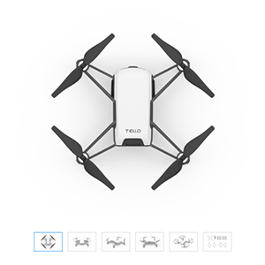

# Drone Project

## Overview

This project uses the DJITelloPy library to control DJI Tello EDU drones. The
drones are commanded by swarms, that are sent commands directed by the Django
site. Models for this site include Users, AP, Swarms and Drones. These models
collect data and control the drones in a selected swarm. AP stands for access
point, and it's also referred to as the router.



## Installation

To get started with the project, clone the repository. In the root directory
of the project, install the dependencies:

```bash
pip install -r requirements.txt
```

Now apply migrations using manage.py to initialise the database. Still in
the root directory of the project:

```bash
python manage.py migrate
```

## Usage

Navigate to the project's root directory and execute the following command
to start the Django site:
```bash
python manage.py runserver
```

* Add a swarm in the site, then add the drones with their information.
* Once the drones are set up, click the "connect" button in the swarm
actions.
* This will connect to the all drones in that swarm and update their battery
percentage once connected.
* If all drones are connected click the "Launch" button at the top of the
screen to launch the drones. The drones should move up, forward, backwards
and then land.
